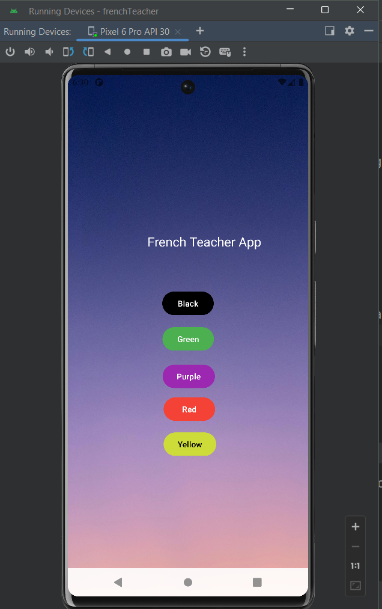

# French Teacher App

## Overview

The French Teacher app is a simple application designed 
to learn using Media player with other components.
The app consists of five buttons, each representing a different color. 
When the user taps on a button, the app plays an audio clip containing a French phrase associated with that color.

## Screenshots

## Features

- Five buttons, each representing a different color: Red, Blue, Green, Yellow, and Purple.
- French audio phrases corresponding to each color are played when the respective button is pressed.
- Simple and intuitive user interface for easy navigation.

## Technologies Used

- Java programming language for Android app development.
- Android Studio IDE for project development and management.
- Android MediaPlayer class for playing audio files.

## Usage

1. Launch the French Teacher app on your Android device.
2. You will be presented with five buttons, each labeled with a different color.
3. Tap on any button to hear a French audio phrase associated with that color.
4. Practice listening to the phrases and familiarize yourself with the French language.

