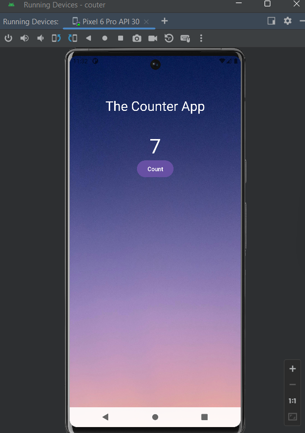

# Counter App

This simple Android application allows users to count numbers by incrementing the count with the click of a button.

## Screenshots

## Functionality

- **Increment Count**: Users can increase the count by clicking the "Increment" button.
- **Display Count**: The current count is displayed on the screen using a TextView.

## Getting Started

To run this app locally, you need to have Android Studio installed on your system.

1. Clone this repository to your local machine using `git clone`.
2. Open the project in Android Studio.
3. Build and run the app on an emulator or a physical device.

## Learning Goals

This project was created as a learning exercise to understand the following concepts:

- Basic UI layout using TextView and Button.
- Handling user interaction with Button clicks.
- Updating and displaying dynamic data (count) in the UI.

