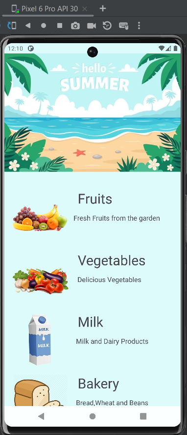

# Grocery Android App

This is a simple Android application for displaying grocery items using a RecyclerView.

## Screenshots

## Overview

The Grocery Android App allows users to view a list of grocery items categorized into different sections such as fruits, vegetables, dairy products, bakery items, beverages, and snacks. Users can click on any item to view its details.

## Features

- Displaying grocery items in a RecyclerView.
- Categorization of grocery items.
- Click event handling for item selection.
- Toast message display for item selection feedback.

## Technologies Used

- Java
- Android SDK
- RecyclerView
- linearLayout
