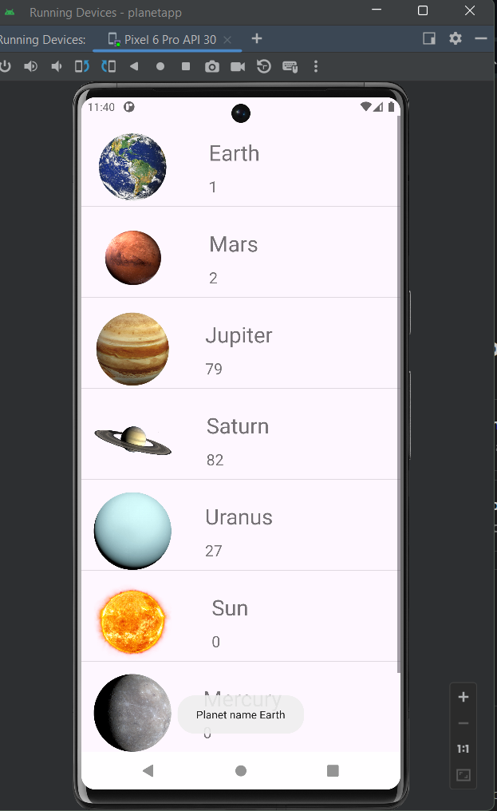

# Planet App
    The Planet App is an Android application created with the intention of learning how to effectively 
    utilize adapters and scroll view components such as ArrayAdapter,
    ListView, and CustomAdapter. This app focuses on displaying information about various planets.

### Screenshot:

## Features:
-  Display a list of planets.
-  Show name of each planet when clicked using Toast Component.
-  Utilize custom adapters for enhanced UI.

## Technologies Used:
-  Android Studio
-  Java

## Installation:
-  Clone the repository to your local machine.
-  Open the project in Android Studio.
-  Build and run the application on an emulator or physical device.

## Code Overview:

### Adapters and ScrollView:
- **ArrayAdapter**: Utilized for populating the list of planets.
- **ListView**: Used to display the list of planets.
- **CustomAdapter**: Employed for customizing the UI of the planet list.

### Learning Outcomes:

- Understanding of adapters in Android development.
- Implementation of ArrayAdapter and CustomAdapter for ListView.
- Handling user interactions with ListView.
- Managing scrollable content with ScrollView.

## Notes:

- Adapters are crucial components in Android development, facilitating the 
  management and display of data in UI components like ListView.
- ArrayAdapter simplifies the process of binding data to views in a ListView by converting an array of objects into view items.
- CustomAdapter provides more flexibility in UI customization, allowing developers to define how each item in the list should be displayed.
- ScrollView enables smooth scrolling of content that extends beyond the visible area of the screen, enhancing user experience in applications with long content.