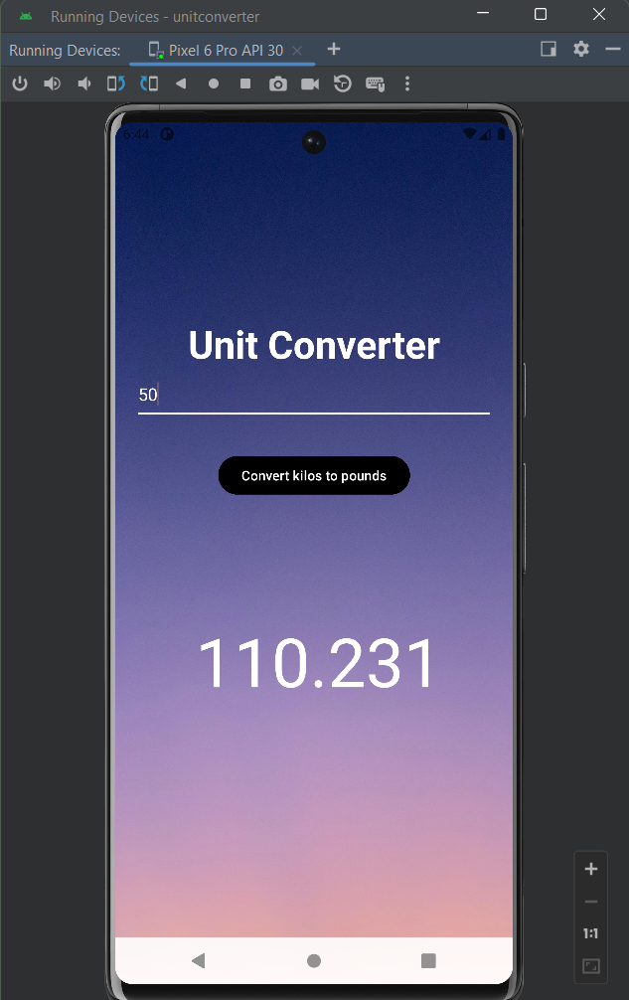

# Unit Converter App

This simple Android application allows users to convert kilograms into pounds. It provides a straightforward interface for users to input the value in kilograms and converts the corresponding value in pounds.

## Screenshots

## Functionality

- **Convert Kilograms to Pounds**: Users can input a value in kilograms, and the app  converts it into pounds.
- **Display Conversion Result**: The converted value in pounds is displayed on the screen using a TextView.

## Getting Started

To run this app locally, you need to have Android Studio installed on your system.

1. Clone this repository to your local machine using `git clone`.
2. Open the project in Android Studio.
3. Build and run the app on an emulator or a physical device.

## Learning Goals

This project was created as a learning exercise to understand the following concepts:

- Basic UI layout using EditText and TextView.
- Handling user input from EditText.
- Performing calculations and conversions based on user input.
- Displaying dynamic data (conversion result) in the UI.

