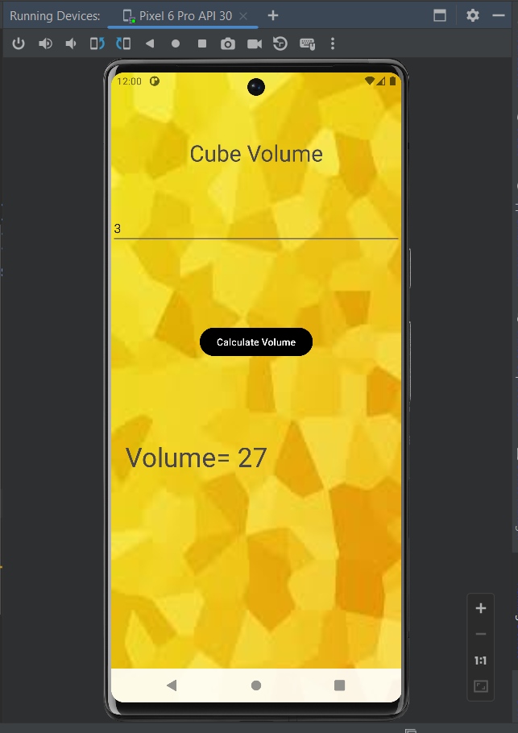
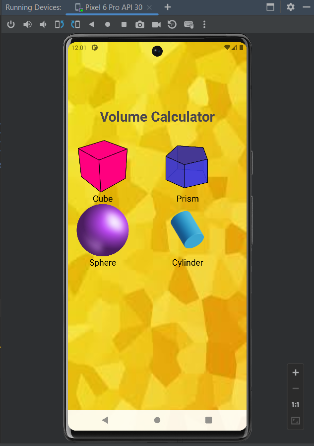

# Volume of an Object Calculator

This project is designed to learn how to use custom adapters, GridView, get input from the user, pass values between layouts, and calculate the volume of various objects.

## Screenshots

## Overview

The Volume of an Object Calculator app allows users to input dimensions of different objects and calculate their volumes. It utilizes a custom adapter to display options for selecting different objects, a GridView layout to present the options, and intuitive user interfaces to input dimensions and display results.

## Features

- **Custom Adapter**: Utilizes a custom adapter to display options for selecting different objects.
- **GridView Layout**: Organizes object selection options in a grid layout for easy navigation.
- **User Input**: Allows users to input dimensions of the selected object.
- **Calculation**: Calculates the volume of the selected object based on the provided dimensions.
- **Results Display**: Displays the calculated volume of the object to the user.

## Technologies Used

- **Android Studio**: IDE for Android app development.
- **Java**: Programming language used for app development.
- **XML**: Markup language used for designing layouts.

