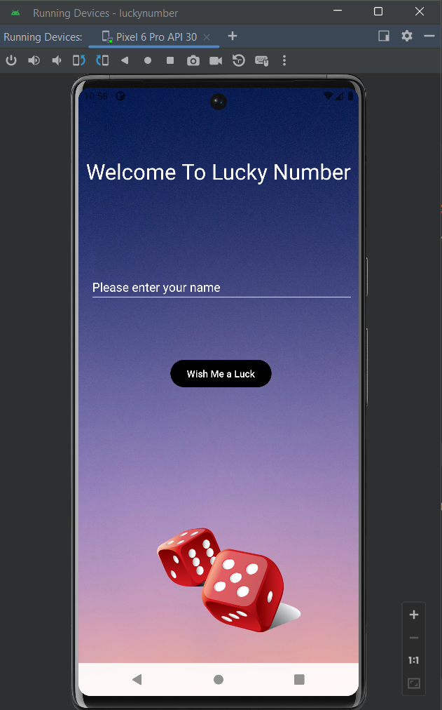
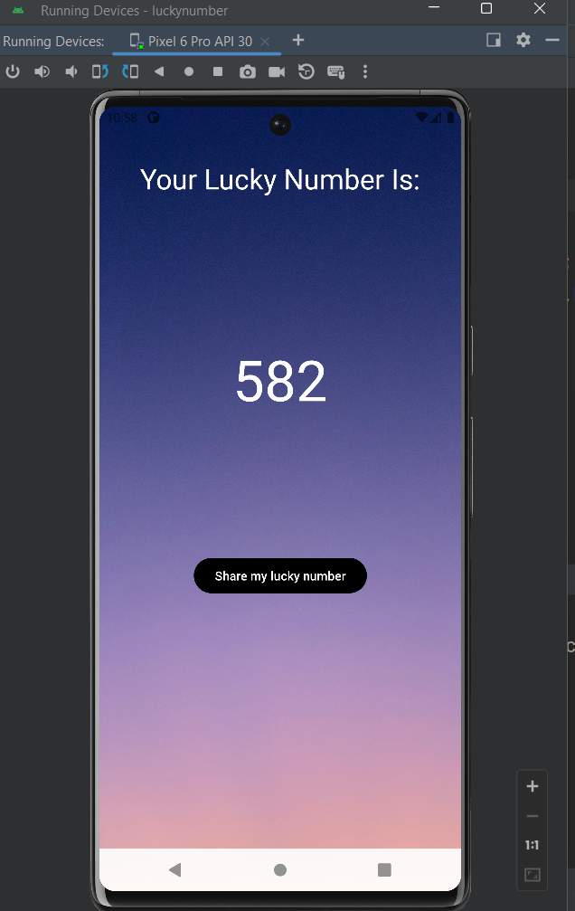
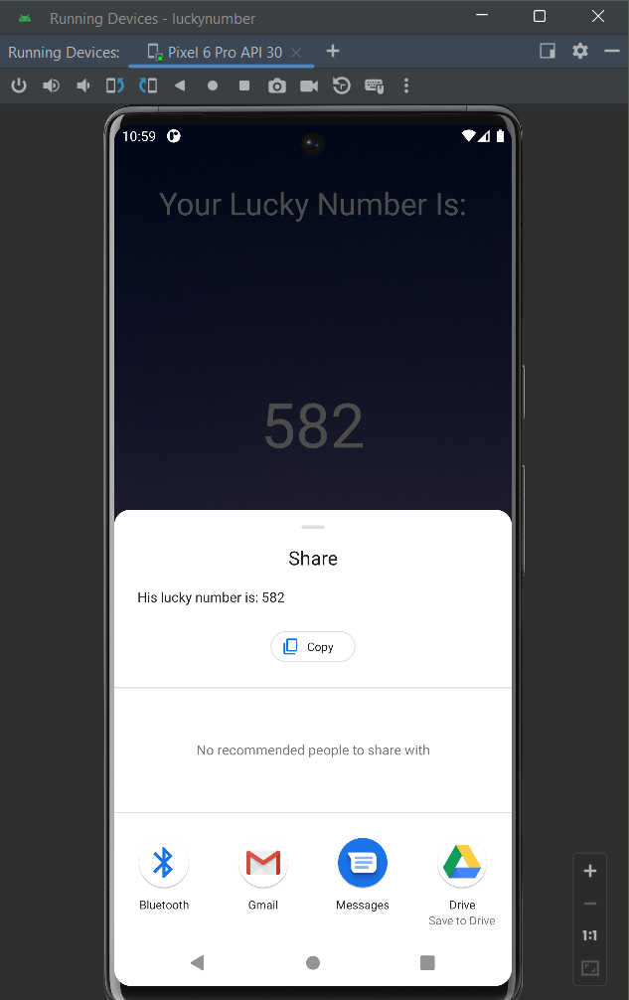

# Lucky Number Generator App

 This simple Android application allows users to generate lucky numbers and navigate to another page to view additional information. In the process, you'll learn how to pass data between activities and display images using ImageView.

## Screenshots





## Functions

- **Generate Lucky Numbers**: Users can generate random lucky numbers by clicking a button.
- **View Additional Information**: Users can navigate to another page to view additional information about the generated numbers.
- **Learn Data Passing**: You'll learn how to pass data from one activity to another.
- **ImageView Usage**: You'll learn how to display images using ImageView.


## Notes

```markdown
# Intents in Android

In Android development, an Intent is a messaging object that facilitates communication between 
components of an Android application, such as activities, services, broadcast receivers, and content 
providers. Intents can be used to perform a wide range of actions, including starting activities, 
broadcasting messages, and invoking services.

## Explicit Intent

An explicit intent is used to launch a specific component within an application by specifying the 
target component's class name. It is typically used when you know the exact component you want to start, 
such as starting an activity within the same application. Here's an example of how to create and use an explicit intent:

```java
Intent intent = new Intent(CurrentActivity.this, TargetActivity.class);
startActivity(intent);
```

## Implicit Intent

An implicit intent is used to perform actions that are not limited to a specific 
component within an application. Instead, it allows the system to determine the best component 
to handle the intent based on its action and data. Implicit intents are useful for actions such as 
opening a web page, sending an email, or making a phone call. Here's an example of how to create and 
use an implicit intent to open a web page:

```java
Intent intent = new Intent(Intent.ACTION_VIEW, Uri.parse("https://example.com"));
startActivity(intent);
```

## Getting Started

To run this app locally, you need to have Android Studio installed on your system.

1. Clone this repository to your local machine using `git clone`.
2. Open the project in Android Studio.
3. Build and run the app on an emulator or a physical device.

## Learning Goals

This project was created as a learning exercise to understand the following concepts:

- Generating random numbers in Android.
- Navigating between activities.
- Passing data between activities using Intent extras.
- Displaying images using ImageView.


